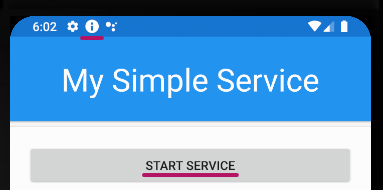
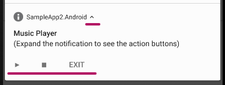
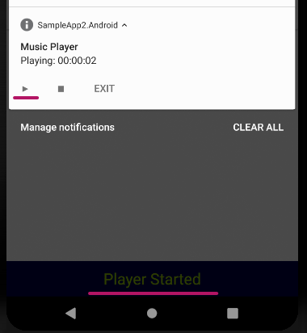

# Sample App 2
This app demonstrates the following:
- Implementing the Service Interface `ISimpleService`
- Starting a service automatically when the user navigates away from the app.
- Adding custom action buttons to the service notification.
- Implementing the custom actions in the service
- Communication from the service to the App.

## Implementing the service interface
1. Implement the ISimpleService interface.
```C#
public class MyService : ISimpleService
{
    public void OnExecuteAction(string actionName, IList<string> args)
    {
        // Event handler for actions declared in the "SimpleServiceOptions"
    }

    public void OnStart(SimpleServiceCore core)
    {
        // Called when the service starts
    }

    public void OnStop(IList<string> args)
    {
        // Called when the service is stopped
    }

    public void OnTapNotification()
    {
        // Called when the user taps the notification
    }
}
```
2. Pass your new service class in with the Start method

```C#
// Create and start a service...
_service = await ServiceManager.Start<MyService>("My Service", "Hello world!");
```

1. Click on the service, notice the notification created:  

2. Expand notification:  

3. Use notification buttons:  

Notice that the service started an action in the app.